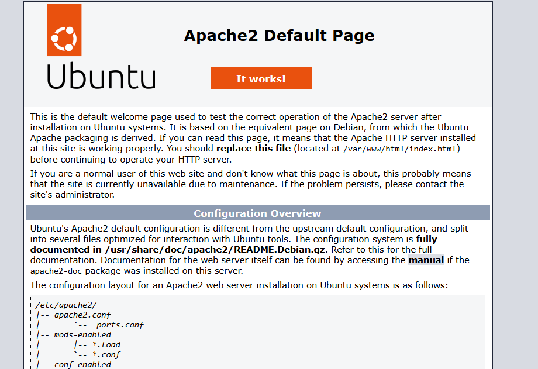
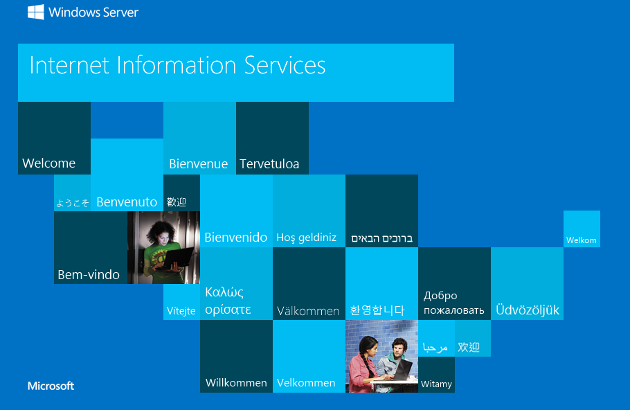

# AzureCorp – Portal Interno Corporativo com Governança e Escalabilidade ☁️

Projeto hands-on baseado nos tópicos da certificação AZ-104, simulando a implantação de um portal interno corporativo com boas práticas de infraestrutura, governança, segurança e automação em Azure.

## 📌 Objetivos
- Simular ambiente corporativo real no Azure
- Estudar tópicos da AZ-104 de forma prática
- Construir portfólio de DevOps / Cloud Administrator

## 🔧 Tecnologias e Serviços
- Azure CLI
- Virtual Network (VNet, Subnets, NSG)
- Virtual Machines (Linux e Windows)
- Azure Storage, RBAC, Azure Monitor, Backup, etc.

## 🗓️ Etapas
| Semana | Tema                            | Status   |
|--------|----------------------------------|----------|
| 1      | Rede virtual e segurança         | ✅ Concluído |
| 2      | Criação de VMs e servidores web  | ✅ Concluído |
| 3      | Identidade, RBAC e políticas     | 🔜 Em breve |
| 4      | Monitoramento e backup           | 🔜 Em breve |
| 5      | Governança e automação           | 🔜 Em breve |

## 📸 Imagens

---
